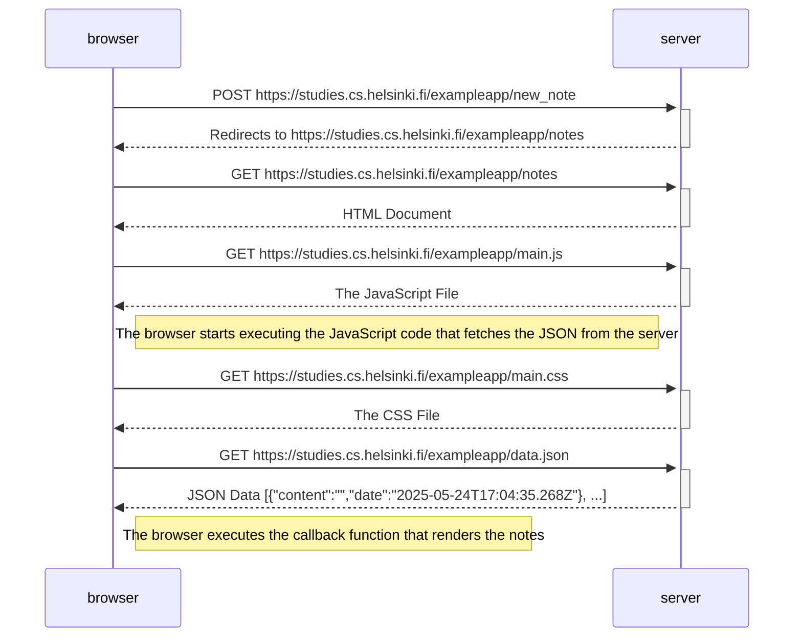

```mermaid
sequenceDiagram
  participant browser as browser
  participant server as server

  browser ->>+ server: POST https://studies.cs.helsinki.fi/exampleapp/new_note
  activate server
  server -->> browser: Redirects to https://studies.cs.helsinki.fi/exampleapp/notes
  deactivate server

  browser ->> server: GET https://studies.cs.helsinki.fi/exampleapp/notes
  activate server
  server -->> browser: HTML Document
  deactivate server

  browser ->> server: GET https://studies.cs.helsinki.fi/exampleapp/main.js
  activate server
  server -->> browser: The JavaScript File
  deactivate server

  Note right of browser: The browser starts executing the JavaScript code that fetches the JSON from the server
  
  browser ->> server: GET https://studies.cs.helsinki.fi/exampleapp/main.css
  activate server
  server -->> browser: The CSS File
  deactivate server

  browser ->> server: GET https://studies.cs.helsinki.fi/exampleapp/data.json
  activate server
  server -->> browser: JSON Data [{"content":"","date":"2025-05-24T17:04:35.268Z"}, ...]
  deactivate server

  Note right of browser: The browser executes the callback function that renders the notes
```
