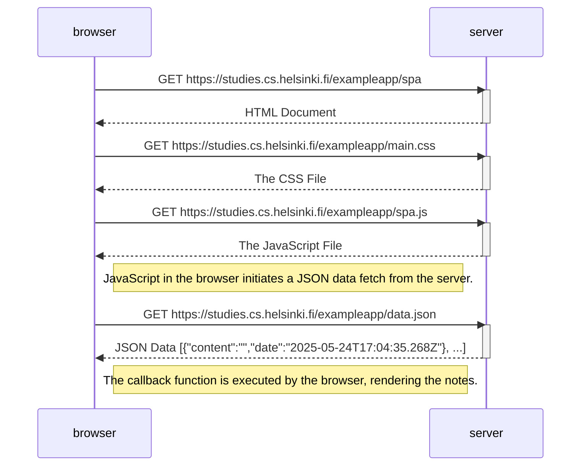

```mermaid
sequenceDiagram
  participant browser as browser
  participant server as server

  browser ->> server: GET https://studies.cs.helsinki.fi/exampleapp/spa
  activate server
  server -->> browser: HTML Document
  deactivate server

  browser ->> server: GET https://studies.cs.helsinki.fi/exampleapp/main.css
  activate server
  server -->> browser: The CSS File
  deactivate server

  browser ->> server: GET https://studies.cs.helsinki.fi/exampleapp/spa.js
  activate server
  server -->> browser: The JavaScript File
  deactivate server

  Note right of browser: JavaScript in the browser initiates a JSON data fetch from the server.
  
  browser ->> server: GET https://studies.cs.helsinki.fi/exampleapp/data.json
  activate server
  server -->> browser: JSON Data [{"content":"","date":"2025-05-24T17:04:35.268Z"}, ...]
  deactivate server

  Note right of browser: The callback function is executed by the browser, rendering the notes.
```
