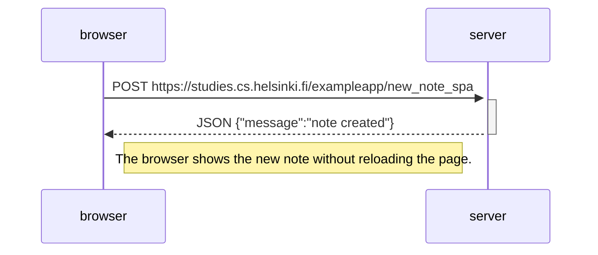

```mermaid
sequenceDiagram
  participant browser as browser
  participant server as server

  browser ->>+ server: POST https://studies.cs.helsinki.fi/exampleapp/new_note_spa
  activate server
  server -->> browser: JSON {"message":"note created"}
  deactivate server

  Note right of browser: The browser shows the new note without reloading the page.
```
